# Cisco Meraki Webhooks & Callbacks Lab

## Table of Contents

1. [Lab Environment Setup](#1-lab-environment-setup)
2. [Webhooks 101](#2-webhooks-101)
3. [Webhook Receivers](#3-webhook-receivers)
4. [Webhook Templates (Included)](#4-webhook-templates-included)
5. [Webhook Templates (Custom)](#5-webhook-templates-custom)
6. [Advanced Templates](#6-advanced-templates)
7. [Webex Integration](#7-webex-integration)
8. [Callbacks 101](#8-callbacks-101)
9. [Callbacks with Live Tools](#9-callbacks-with-live-tools)
10. [Callbacks with Action Batches](#10-callbacks-with-action-batches)
11. [Google Sheets Integration](#11-google-sheets-integration)
12. [Final Challenge: Alerts, Callbacks, and Custom Images Message to Google Sheets](#12-final-challenge-alerts-callbacks-and-custom-images-message-to-google-sheets)
13. [Quick Recap](#quick-recap)
14. [Resources](#resources)

---

## 1. Lab Environment Setup


### Overview
Before you begin, you need access to the Meraki Dashboard, an API key, and a Google Sheets server URL for logging and integration. These resources are important for completing the hands-on exercises in this lab.

### Step-by-Step Instructions
1. Obtain your **Dashboard Organization ID** from your lab proctor or instructor.
2. Access the **Meraki Dashboard** at [https://dashboard.meraki.com](https://dashboard.meraki.com).
3. Log in using the provided credentials:
   - Email: `apidemo@meraki.com`
   - Password: _provided by proctor_
4. Get your **Lab User API Key** (provided by proctor or generate your own as instructed).
5. Obtain the **Google Sheets Final Exam Server URL** (provided by proctor or set up your own).
6. Gather any other shared resources or URLs needed for the lab.

### Success Criteria
- I have access to the Meraki Dashboard with the correct organization.
- I have a valid API key and Google Sheets server URL.
- I am ready to proceed with the lab exercises.

---

## 2. Webhooks 101

### Learning Objectives
- Understand what a webhook is and why it is useful.
- Recognize the difference between webhooks and traditional polling.
- Identify the structure of a Meraki webhook payload.

### Overview
Webhooks are a powerful and lightweight solution to send messages to a remote service using HTTP/HTTPS protocols. These messages can be broadcasted to communication channels, trigger automation events, or be stored in a database. Unlike polling, webhooks provide real-time notifications.

When Meraki triggers a webhook alert, it sends a JSON payload containing a set of standard properties. Understanding these properties is important for building reliable automations, integrations, and monitoring solutions.

**Common Meraki Webhook Alert Properties:**

| Name             | Format       | Description                                                            |
| ---------------- | ------------ | ---------------------------------------------------------------------- |
| alertData        | object       | Object of unique parameters for each alert                             |
| alertId          | string       | ID for this alert message                                              |
| alertType        | string       | Type of alert (e.g., "Network usage alert", "Settings changed")        |
| networkId        | string       | ID for the Meraki network                                              |
| networkName      | string       | Name for the Meraki network                                            |
| occurredAt       | UTC          | Timestamp of the alert                                                 |
| organizationId   | string       | ID of the Meraki organization                                          |
| organizationName | string       | Name of the Meraki organization                                        |
| sentAt           | UTC          | Timestamp of the sent message                                          |
| sharedSecret     | string       | User defined secret to be validated by the webhook receiver (optional) |
| version          | float        | Current version of webhook format                                      |

**Security Best Practices:**
- Always use HTTPS for your webhook receivers. Meraki requires a valid SSL/TLS certificate (no self-signed certs).
- Use the `sharedSecret` to validate incoming webhooks and prevent spoofing.

### Step-by-Step Instructions
1. Review the example webhook payload below to understand the structure:

```json
{
  "alertId": "12345",
  "alertType": "APs went down",
  "networkId": "L_747597538143503285",
  "networkName": "Main Office",
  "occurredAt": "2024-06-01T14:23:00Z",
  "organizationId": "54321",
  "organizationName": "Acme Corp",
  "sentAt": "2024-06-01T14:23:05Z",
  "sharedSecret": "mysecret",
  "version": 0.2,
  "alertData": {
    "mac": "00:11:22:33:44:55",
    "rssi": -94
  }
}
```
2. Identify each field in the payload and its purpose using the table above.
3. Note the importance of using HTTPS and the shared secret for security.

### Success Criteria
- I can describe what a webhook is and how it differs from polling.
- I can identify the key fields in a Meraki webhook payload.
- I understand the importance of using HTTPS and shared secrets for security.

---

## Postman Setup

**Objective:** Ensure you can use Postman with the Meraki API and webhooks.

**Step-by-Step:**
1. **Import the Meraki Postman Collection:**
   - Download from [Meraki Postman Collection](https://documenter.getpostman.com/view/897512/SzYXYfmJ) or use the import link provided by your instructor.
   - When the Postman webpage loads, click **Run in Postman** to run the collection locally on your lab computer.
2. **Set the `{{apiKey}}` Environment Variable:**
   - In Postman, go to **Environments** and create a new environment (e.g., "Meraki Lab").
   - Add a variable named `apiKey` and paste your Meraki API key as the value.
   - Select this environment before sending requests.
3. **Import the Webhook Samples Collection:**
   - Download or import the webhook samples collection as provided by your instructor or from the [Meraki Webhook Samples Collection](https://documenter.getpostman.com/view/897512/SVfRtnU7?version=latest).
4. **Set the `{{webhook-url}}` Environment Variable:**
   - In your environment, add a variable named `webhook-url` and set it to your webhook receiver URL (e.g., your webhook.site or Google Sheets Apps Script URL).


---

## 3. Webhook Receivers

### Learning Objectives
- Configure a webhook receiver using webhook.site.
- Add and test a receiver in the Meraki Dashboard.

### Overview
A webhook receiver is a service or endpoint that listens for incoming webhook notifications. For testing and learning, [webhook.site](https://webhook.site/) provides a simple way to receive and inspect webhook payloads sent from Meraki. This helps you verify that your webhooks are working and lets you see the exact data being sent.

### Step-by-Step Instructions
1. Go to [webhook.site](https://webhook.site/) and copy your unique URL.
   
   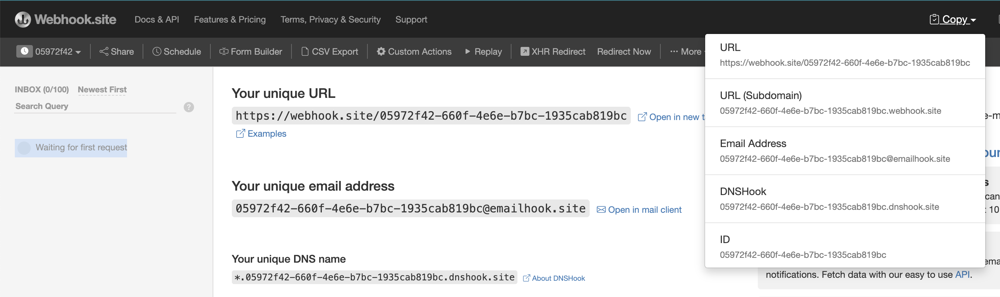

2. In the [Meraki Dashboard](https://dashboard.meraki.com), navigate to **Organization > API & Webhooks**.
   
   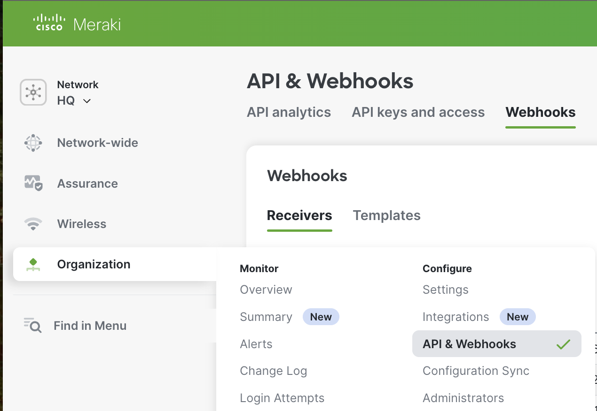

3. Under **Webhooks > Receivers**, click **Add Receiver** and paste your webhook.site URL.
   
   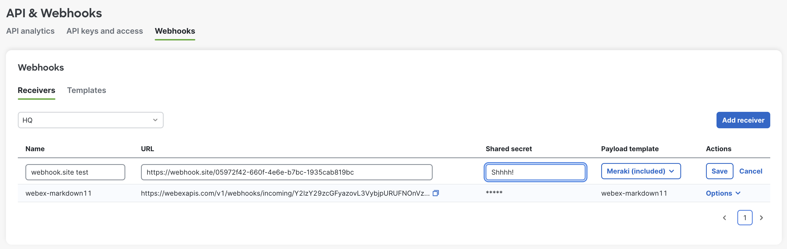

4. Click **Save** and then **Send test webhook**.
   
   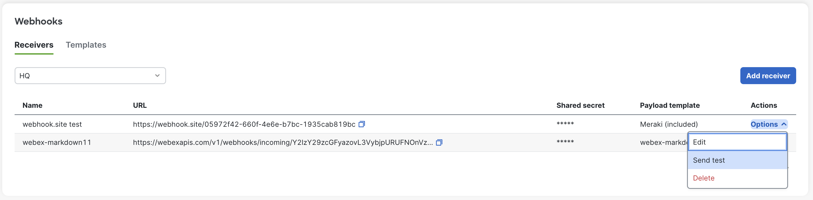

5. On the webhook.site screen, you should see the output if everything worked properly.
   
   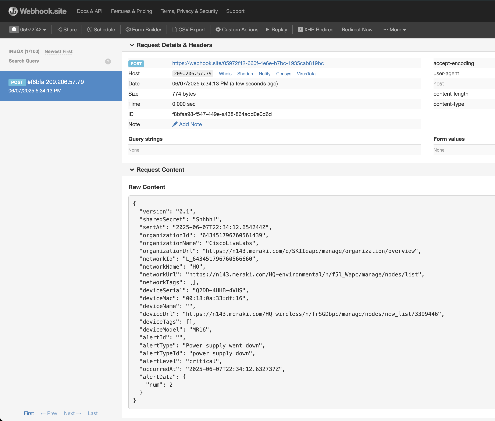

#### Example JSON Payload
```json
{
  "alertId": "12345",
  "alertType": "APs went down",
  "networkId": "L_747597538143503285",
  "networkName": "Main Office",
  "occurredAt": "2024-06-01T14:23:00Z",
  "organizationId": "54321",
  "organizationName": "Acme Corp",
  "sentAt": "2024-06-01T14:23:05Z",
  "sharedSecret": "mysecret",
  "version": 0.2,
  "alertData": {
    "mac": "00:11:22:33:44:55",
    "rssi": -94
  }
}
```

### Success Criteria
- I can configure a webhook receiver using webhook.site.
- I can send a test webhook from the Meraki Dashboard and see the payload appear on webhook.site.
- I can identify key fields in the received JSON payload.

---

## 4. Webhook Templates (Included)

### Learning Objectives
- Understand the difference between included and custom webhook templates.
- Preview and compare the default template output in Meraki.

### Overview
Meraki provides a set of included (default) webhook templates that define the structure and content of webhook payloads. These templates cannot be edited, but you can use them as a starting point for your own custom templates. Previewing these templates helps you understand the default payload structure and how it changes for different alert types or integrations (e.g., Webex, Slack).

### Step-by-Step Instructions
1. In the Meraki Dashboard, go to **Organization > API & Webhooks** and select the **Webhook Templates** tab.
2. Review the list of included templates.
   
   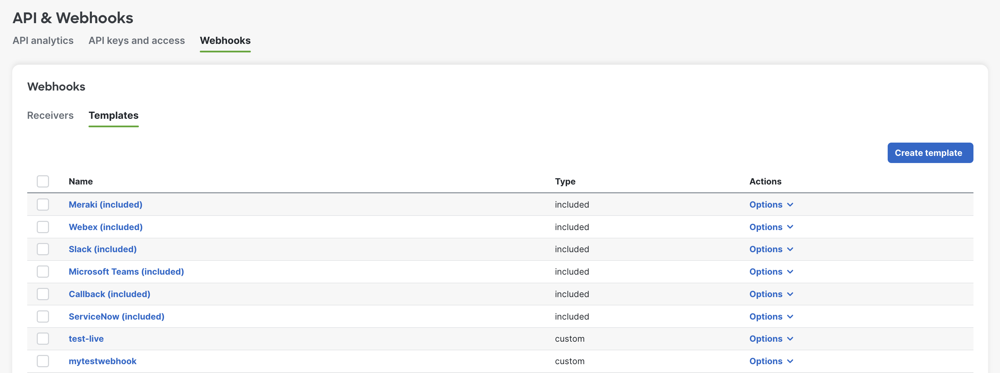

3. Click on the **Meraki (included)** template and click **Generate Preview** to see the output.
   
   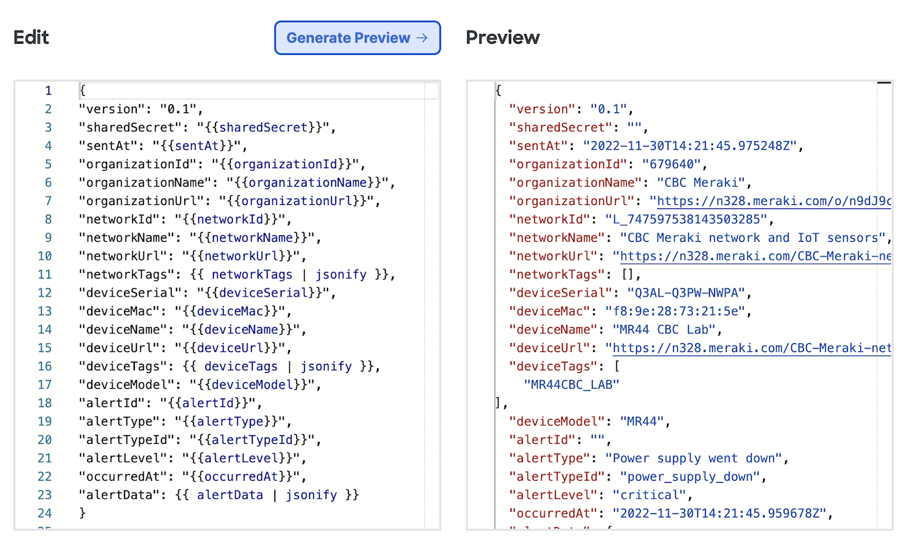

4. Explore other templates by sending a webhook test to your webhook.site address.
   
   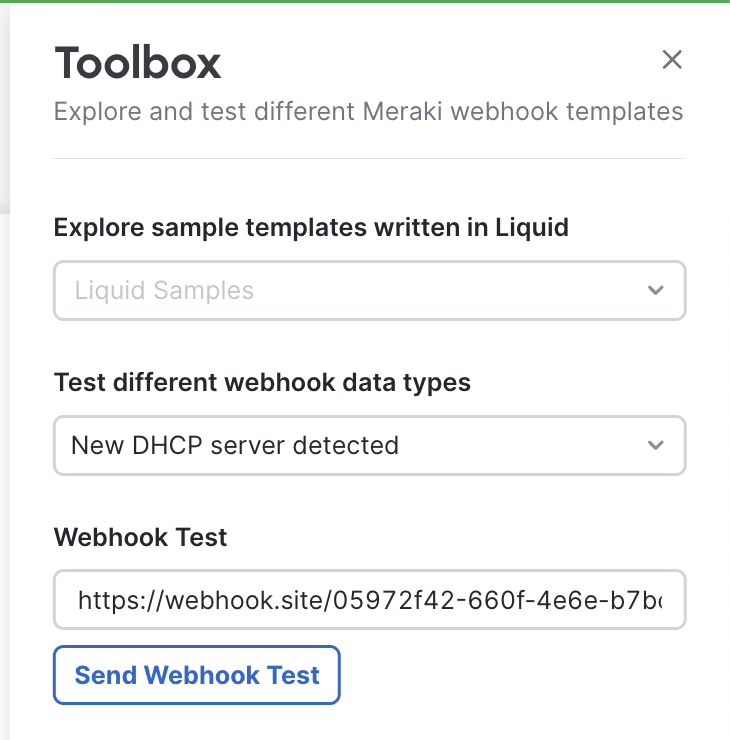

5. Select a different included template, such as Webex or Slack, to see how the contents change. Send the test to your test URL.
   
   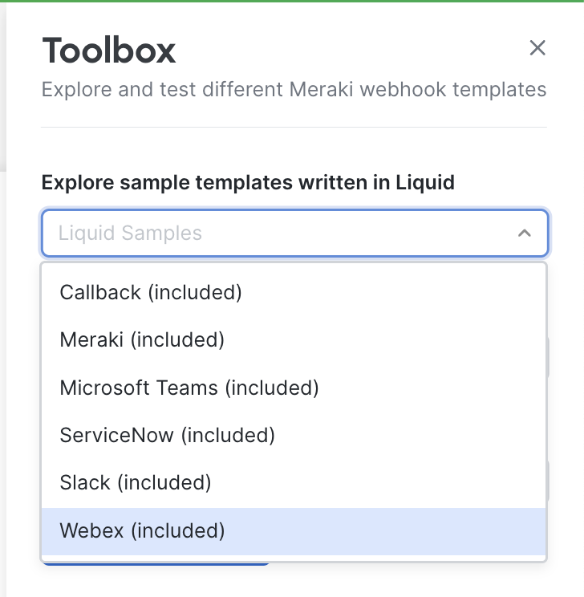

6. Select different webhook alert data types from the toolbox to see how the contents change.
   
   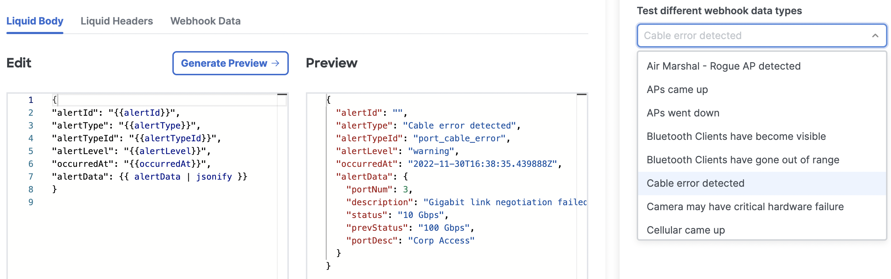

### Success Criteria
- I can preview the output of included webhook templates in the Meraki Dashboard.
- I can compare how different templates and alert types affect the payload structure.
- I understand that included templates cannot be edited, but can be used as a reference for custom templates.

---

## 5. Webhook Templates (Custom)

### Learning Objectives
- Learn the basics of Liquid template syntax: variables, tags, filters.
- Build and test a custom webhook template in Meraki.

### Overview
Meraki uses the [Liquid template language](https://shopify.github.io/liquid/) to let you customize webhook payloads. Custom templates allow you to tailor the webhook data to your needs, including formatting, logic, and extracting specific fields. You can use variables, control flow, and filters to create powerful and flexible payloads.

**Key Liquid Concepts:**
- **Variables:** Use double curly braces to insert values (e.g., `{{ networkId }}`).
- **Tags:** Add logic and control flow (e.g., ` ... `).
- **Filters:** Transform data (e.g., `{{ alertData | jsonify }}`).

### Step-by-Step Instructions
1. In the Webhook Templates tab, click **Create template**.
2. Optionally preload the **Meraki (included)** template from the toolbox.
3. Edit the payload template to your needs and click **Generate Preview**.
   
   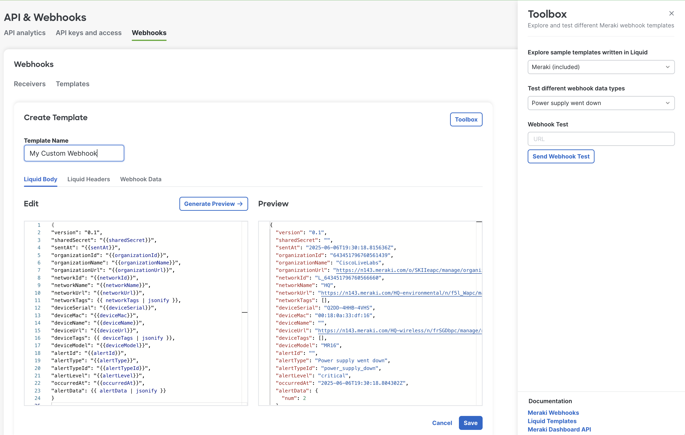

#### Example Custom Template (with Key Liquid Concepts)
```liquid
{
  "version": "0.2",
  "organizationName": "{{ organizationName }}",
  "networkName": "{{ networkName }}",
  "alertType": "{{ alertType }}",
  "alertTypeId": "{{ alertTypeId }}",
  "is_critical": "yesno",
  "alert_keys": "{{ alertData | keys | join: ', ' }}",
  "alertData": {{ alertData | jsonify }}
}
```
**Rendered Output Example:**
```json
{
  "version": "0.2",
  "organizationName": "My organization",
  "networkName": "Main Office",
  "alertType": "Bluetooth Clients have become visible",
  "alertTypeId": "bluetooth_in",
  "is_critical": "no",
  "alert_keys": "mac, name, rowStartedAt, bluetoothClientId, rssi, seenAt",
  "alertData": {
    "mac": "00:11:22:33:44:55",
    "name": "",
    "rowStartedAt": {
      "millisFromEpoch": 1563208308228
    },
    "bluetoothClientId": "0000000000000000",
    "rssi": -94,
    "seenAt": {
      "millisFromEpoch": 1563519260925
    }
  }
}
```

#### Custom Headers
You can add several custom REST headers under the **Liquid Headers** tab. These are often used for authentication (such as API keys or Bearer tokens) and for identifying your application.

1. In the **Webhook Data** tab, set a temporary shared secret for testing. This value is configurable and will be used in your template as `{{sharedSecret}}`.
2. Switch to the **Liquid Headers** tab. Add the desired headers. For example, you can create an `Authentication` header with the value `Bearer {{sharedSecret}}` to simulate Bearer token authentication. You can also add a `user-agent` header to identify your application.
3. Press the **Generate Preview** button to see the resulting headers with your test values substituted in.
4. You can send a webhook to your test site (such as webhook.site) to verify that the headers are included as expected.

> **Note:** When creating a real webhook receiver, you must specify the appropriate `sharedSecret` value so that authentication works as intended.

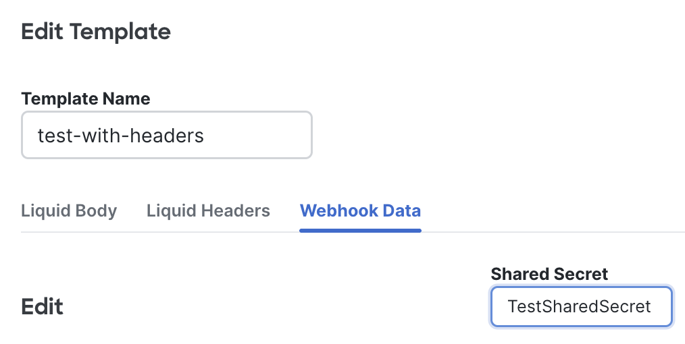

Test and observe the result:

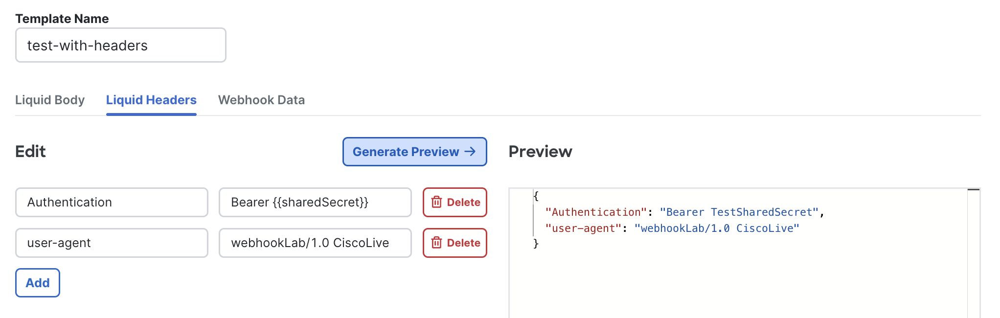

### Success Criteria
- I can create and edit a custom webhook template using Liquid syntax.
- I can preview the rendered output and verify it matches my expectations.
- I can define custom headers if needed.

---

## 6. Advanced Templates

### Learning Objectives
- Test different alert types and use advanced Liquid features.
- Use logic, filters, and array/object handling in Liquid templates.

### Overview
Advanced Liquid features allow you to create dynamic and context-aware webhook payloads. You can use logic (if/else), capture computed values, extract nested data, and work with arrays and objects. This enables you to format output based on alert type or data, and to create more useful and readable notifications.

**Key Advanced Techniques:**
- Use `capture` to build multi-line or computed values.
- Add conditional fields using `if/else` logic.
- Extract nested values with the `dig` filter.
- List all keys in an object with the `keys` filter.

### Step-by-Step Instructions
1. In the template editor, use the toolbox menu to **Test different webhook data types** to preview various alert payloads.
2. Modify your custom webhook template to include at least two of the following advanced techniques:
   - Use `capture` to create a summary or computed field.
   - Add a conditional field using `if/else` logic (e.g., set a severity or priority field).
   - Extract a nested value from `alertData` using the `dig` filter.
   - List all keys in `alertData` using the `keys` filter.

#### Example: Using `capture` and `if/else`
```liquid

  {{ alertType }} on {{ deviceSerial }} at {{ occurredAt | date: '%H:%M' }}

{
  "summary": "{{ summary | strip }}",
  "severity": "CRITICALNormal",
  "alertType": "{{ alertType }}",
  "alertTypeId":"{{ alertTypeId }}"
}
```

#### Example: Working with Arrays and Objects
```liquid
{
  "all_keys": "{{ alertData | keys | join: ', ' }}"
}
```

3. Use the toolbox to preview your template with different alert types and data.
4. Verify that your new fields appear and change as expected based on the input data.

### Success Criteria
- My template uses at least two advanced Liquid features (capture, if/else, dig, keys, etc.).
- I can see the new or modified fields in the preview output.
- The output changes appropriately when I test with different alert data.

---

## 7. Webex Integration

### Learning Objectives
- Use advanced Liquid features (e.g., `capture`, `json_markdown`).
- Send a webhook payload to a Webex room with Markdown formatting.

### Overview
Webex supports incoming webhooks that allow you to send messages directly to a Webex space. This is useful for alerting teams in real time when important events occur in your Meraki network. By using advanced Liquid features, you can format your webhook payloads with Markdown for better readability in Webex.

### Step-by-Step Instructions
1. **Set up an Incoming Webhook in Webex:**
   - Go to the [Webex Incoming Webhooks App Hub page](https://apphub.webex.com/applications/incoming-webhooks-cisco-systems-38054-23307-75252) and click **Connect**.
   - Name your webhook and select the Webex space where messages should be sent.
   - Note the webhook URL provided (it will look like `https://webexapis.com/v1/webhooks/incoming/<YOUR DYNAMIC URL>`).
   
   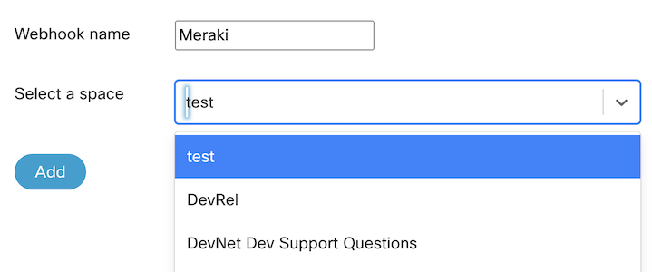

2. **Create a Webex Custom Template in Meraki:**
   - In the Webhook Templates tab, click **Create template**.
   - Use the following Liquid template for the body:

```liquid

### {{alertType}}
Alert ID: {{alertId}}
Alert level: {{alertLevel}}
Occurred at: {{occurredAt}}

Organization name: {{organizationName}}
Organization ID: {{organizationId}}
Network name: {{networkName}}
Network ID: {{networkId}}

Device name: {{deviceName}}
Device serial: {{deviceSerial}}
Device MAC: {{deviceMac}}
Device tags: {{deviceTags | jsonify}}
Device model: {{deviceModel}}

Alert Data
>>
{{alertData | json_markdown}}


{
    "sentAt": "{{sentAt}}",
    "markdown": {{markdown | jsonify}},
    "networkId": "{{networkId}}"
}
```

**Rendered Output Example:**
```json
{
  "sentAt": "2024-06-01T14:23:00Z",
  "markdown": "### APs went down\nAlert ID: 12345\nAlert level: critical\nOccurred at: 2024-06-01T14:22:00Z\n\nOrganization name: Acme Corp\nOrganization ID: 54321\nNetwork name: Main Office\nNetwork ID: L_747597538143503285\n\nDevice name: SWITCH-1\nDevice serial: Q2BX-9QRR-XXXX\nDevice MAC: 00:11:22:33:44:55\nDevice tags: [\"core\", \"access\"]\nDevice model: MS120-8LP\n\nAlert Data\n>>\n- mac: 00:11:22:33:44:55\n- rssi: -94",
  "networkId": "L_747597538143503285"
}
```

3. **No Custom Headers Required:**
   - The headers for this integration can be left empty.

4. **Configure the Webhook Receiver:**
   - In Meraki, add a new HTTP server using your Webex webhook URL as the receiver.
   - Assign your custom Webex template to this receiver.
   - Send a test webhook and verify the message appears in your Webex space.

   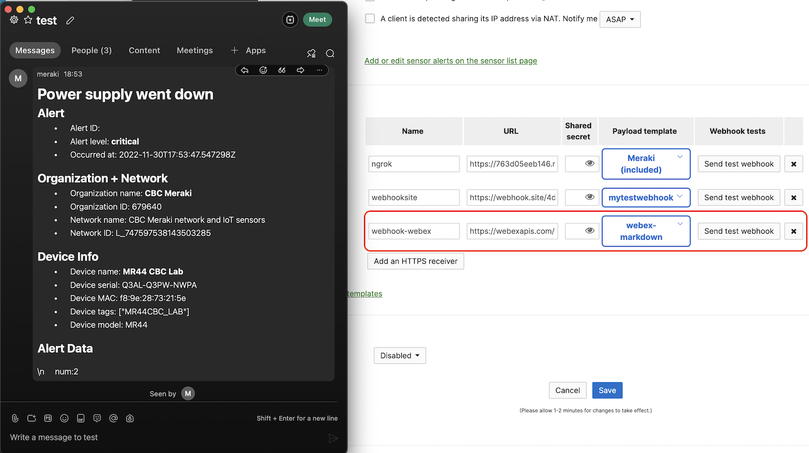

### Success Criteria
- I can send a webhook payload to a Webex space using a custom template.
- The message appears in the Webex space with Markdown formatting.
- The payload includes all relevant alert and device information.

---

## 8. Callbacks 101

### Learning Objectives
- Understand what a callback is and how it differs from a regular webhook alert.
- Recognize the structure of a Meraki callback payload.

### Overview
A callback is a webhook sent by Meraki when a long-running API operation (like a ping or action batch) completes. Instead of polling for results, you receive a notification when the operation is done. Callback payloads have a different structure from alert payloads and are designed to provide the results of asynchronous operations.

**Key Points:**
- Callbacks are used for asynchronous API operations (e.g., ping, action batches).
- The callback payload contains operation status and results, not alert data.
- You should create custom templates designed for callback data.

### Step-by-Step Instructions
1. Review the example callback payload below to understand the structure:

```json
{
  "callbackId": "643451796760560204",
  "organization": {
    "id": "321321",
    "name": "My Laboratory"
  },
  "network": {
    "id": "643451796760500000",
    "name": "Branch 1"
  },
  "sentAt": "2023-09-15T06:46:17-07:00",
  "message": {
    "pingId": "643451796835419513",
    "url": "/devices/Q2BX-9QRR-XXXX/liveTools/ping/64345179683500000",
    "request": {
      "serial": "Q2BX-9QRR-XXXX",
      "target": "8.8.8.8",
      "count": "3"
    },
    "status": "complete",
    "results": {
      // Results of the ping operation...
    }
  }
}
```
2. Identify the key fields in the callback payload:
   - `callbackId`: Unique identifier for this callback event
   - `organization`, `network`: Context for the operation
   - `message.status`: Will be `complete` when finished
   - `message.results`: Contains the actual operation results
3. Note: The JSON schema for callbacks will not have the same shape or properties as an alert. Adjust your templates accordingly.

### Success Criteria
- I can explain what a callback is and how it differs from a regular webhook alert.
- I can identify the key fields in a Meraki callback payload.
- I understand that callback templates must be designed for callback data, not alert data.

---

## 9. Callbacks with Live Tools

### Learning Objectives
- Use Postman to send a ping request to Meraki with a callback URL.
- Understand the callback payload and how to monitor asynchronous operations.

### Overview
When you use the Meraki API with Live Tools such as "ping" or "cableTest", you can provide a callback URL. Instead of waiting for the operation to finish, Meraki will send the results to your callback URL (e.g., webhook.site) when the operation completes. This is ideal for long-running or asynchronous tasks. The callback payload will contain the results of the operation.

### Step-by-Step Instructions
1. In Postman, create a request to the following endpoint (or use the provided request in the Meraki API collection):
   - `POST /devices/{serial}/liveTools/ping`
2. Use the following sample request body, replacing the callback URL with your own (e.g., from webhook.site or Google Sheets):

```json
{
  "target": "8.8.8.8",
  "count": 4,
  "callback": {
    "url": "https://webhook.site/your-custom-url"
  }
}
```
3. Send the request from Postman.
4. Check your callback URL (e.g., webhook.site) for the incoming callback payload.

#### Sample Callback Payload
```json
{
  "callbackId": "643451796760560204",
  "organization": {
    "id": "321321",
    "name": "My Laboratory"
  },
  "network": {
    "id": "643451796760500000",
    "name": "Branch 1"
  },
  "sentAt": "2023-09-15T06:46:17-07:00",
  "message": {
    "pingId": "643451796835419513",
    "url": "/devices/Q2BX-9QRR-XXXX/liveTools/ping/64345179683500000",
    "request": {
      "serial": "Q2BX-9QRR-XXXX",
      "target": "8.8.8.8",
      "count": "3"
    },
    "status": "complete",
    "results": {
      // Results of the ping operation...
    }
  }
}
```

### Success Criteria
- I can send a ping request with a callback URL using Postman.
- I receive a callback payload at my specified URL when the operation completes.
- I can identify the results of the operation in the callback payload.

---

## 10. Callbacks with Action Batches

### Learning Objectives
- Use Postman to send an action batch request to Meraki with a callback URL.
- Understand the callback payload and how to monitor bulk asynchronous operations.

### Overview
Action Batches allow you to execute multiple API actions in a single request. By providing a callback URL, you can receive a notification when the batch is processed, including the results for each action. This is especially useful for bulk configuration changes and triggering multi-step automation routines. The callback payload will contain the status and results for each action in the batch.

### Step-by-Step Instructions
1. In Postman, create a request to the following endpoint:
   - `POST /organizations/{organizationId}/actionBatches`
2. Use the following sample request body, replacing the callback URL with your own (e.g., from webhook.site or Google Sheets):

```json
{
  "organizationId": "123456",
  "confirmed": true,
  "synchronous": false,
  "actions": [
    {
      "resource": "/networks/{networkId1}/ssids/0",
      "operation": "update",
      "body": {
        "name": "New SSID Name 1",
        "enabled": true
      }
    },
    {
      "resource": "/networks/{networkId2}/ssids/1",
      "operation": "update",
      "body": {
        "name": "New SSID Name 2",
        "enabled": false
      }
    }
  ],
  "callback": {
    "url": "https://webhook.site/your-custom-callback-url"
  }
}
```
3. Send the request from Postman.
4. Check your callback URL (e.g., webhook.site) for the incoming callback payload.

#### Sample Callback Payload
```json
{
  "callbackId": "874399285760560205",
  "organization": {
    "id": "123456",
    "name": "Global Tech Inc."
  },
  "actionBatchId": "874399285760580000",
  "sentAt": "2023-10-01T09:30:00-07:00",
  "message": {
    "status": "completed",
    "results": {
      "actionsCompleted": 2,
      "actionsFailed": 0,
      "details": [
        {
          "networkId": "networkId1",
          "resource": "/networks/{networkId1}/ssids/0",
          "operation": "update",
          "status": "success"
        },
        {
          "networkId": "networkId2",
          "resource": "/networks/{networkId2}/ssids/1",
          "operation": "update",
          "status": "success"
        }
      ]
    }
  }
}
```

### Success Criteria
- I can send an action batch request with a callback URL using Postman.
- I receive a callback payload at my specified URL when the batch is processed.
- I can identify the status and results for each action in the callback payload.

---

## 11. Google Sheets Integration

### Learning Objectives
- Integrate Meraki webhooks with Google Sheets for logging and analysis.
- Deploy a Google Apps Script as a webhook receiver.

### Overview
You can use Google Sheets as a simple and effective webhook receiver to log and analyze Meraki webhook and callback data. By deploying a Google Apps Script as a web app, you can receive HTTP POST requests and automatically append the data to your spreadsheet for easy tracking and reporting.

### Step-by-Step Instructions
1. **Set Up Google Sheets**
   - Create a new [Google Sheet](https://sheets.new).
   - Go to `Extensions` > `Apps Script`.
   - Delete any code in the script editor and paste the following code:


```javascript
function doPost(e) {
  var sheet = SpreadsheetApp.getActiveSpreadsheet().getActiveSheet();
  var data = JSON.parse(e.postData.contents);
  // Extracts specific fields for the table columns
  sheet.appendRow([
    new Date(),
    data.alertId || data.callbackId || "",
    data.alertType || (data.message && data.message.status) || "",
    JSON.stringify(data)
  ]);
  return ContentService.createTextOutput(JSON.stringify({ "status": "success" }));
}
```
   > **Or, for a more comprehensive version, [click here to view webhook_receiver_code.gs](webhook_receiver_code.gs) and copy/paste its contents into your Apps Script editor.**

2. **Deploy the Script**
   - Save the script with a name.
   - Click `Deploy` > `New deployment`.
   - Select `Web app` and set `Execute as` to `Me` and `Who has access` to `Anyone`.
   - Copy the Web app URL provided.
   > Note: You will need to authorize this app to run and "trust this application"

3. **Configure Postman**
   - Use the Web app URL as the `callback.url` in your `/ping` or action batch request body:

```json
{
  "target": "8.8.8.8",
  "count": 2,
  "callback": {
    "url": "YOUR_GOOGLE_SHEETS_URL"
  }
}
```

4. **Send the Request**
   - Send the request from Postman.
   - Check your Google Sheet for the new row with the callback data.

### Success Criteria
- I can deploy a Google Apps Script as a webhook receiver.
- I can send a webhook or callback to my Google Sheets URL and see the data logged in the sheet.
- The sheet contains relevant fields from the webhook or callback payload.

---

## 12. Final Challenge: Alerts, Callbacks, and Custom Images Message to Google Sheets

### Learning Objectives
- Send a webhook callback for a ping and an action batch to Google Sheets.
- Send a webhook alert with a custom image URL to Google Sheets.
- Create and test a custom Liquid template that includes dynamic content.

### Overview
This final challenge brings together all the skills you've learned in the lab. You'll send both alert and callback data to your Google Sheets webhook receiver, and create a custom template that includes a dynamic image URL using Liquid. This exercise demonstrates how to combine Meraki webhooks, callbacks, and external integrations for real-world automation and monitoring.

### Step-by-Step Instructions
1. **Create a Custom Template with a Dynamic Image URL**
   - In the Meraki Webhook Template Editor, use Liquid's `assign` or `capture` to build a dynamic image URL based on the alert type.

```liquid

{
  "summary": "{{alertType}} from {{ networkName }}",
  "imageUrl": "https://cataas.com/cat/says/{{ cat_message }}",
  "alertData": {{ alertData | jsonify }},
  "occurredAt": "{{ occurredAt }}",
  "alertTypeId": "{{alertTypeId}}",
  "alertType": "{{alertType}}"
}
```

2. **Configure the Google Sheets Webhook Receiver**
   - Use your Google Sheets Apps Script URL as the webhook receiver endpoint.

3. **Send a Webhook Alert to Google Sheets**
   - Trigger a webhook alert (e.g., `motion_detected`) using your custom template.
   - Verify that the data, including the custom image URL, appears in your Google Sheet.

4. **Send a Webhook Callback to Google Sheets**
   - Send a webhook callback for a ping or action batch to your Google Sheets receiver.
   - Adjust your template as needed for callback data (note: there is no `alertData` for a callback).

5. **Verify the Results**
   - Check your Google Sheet to ensure all relevant data, including the custom image URL, is logged.

### Success Criteria
- I can send both webhook alerts and callbacks to my Google Sheets receiver.
- My custom template includes a dynamic image URL and logs the correct data.
- The Google Sheet contains all relevant fields from both alert and callback payloads.

---

## Quick Recap

Congratulations on completing the Cisco Meraki Webhooks & Callbacks Lab!

### Key Takeaways
- Webhooks provide real-time notifications for important events in your Meraki network.
- You can configure webhook receivers and use both included and custom templates with the Liquid language.
- Advanced Liquid features allow for dynamic, context-aware payloads.
- Integration with tools like Webex and Google Sheets enables real-world automation and monitoring.
- Callbacks notify you when asynchronous operations (like ping or action batches) complete.
- You practiced sending both alerts and callbacks to Google Sheets, including custom dynamic content.

**Next Steps:**
- Explore more advanced Meraki API features in the [Meraki Developer Hub](https://developer.cisco.com/meraki/).
- Try building your own automation or dashboard using the skills you've learned.
- Share your feedback to help us improve this lab for future learners!

**Feedback:**
We value your input! Please take a moment to fill out the session survey and let us know what you thought.

---

## Resources

- [Meraki Webhooks Documentation](https://developer.cisco.com/meraki/webhooks/): Official documentation for Meraki webhooks.
- [Webhook Custom Template collection](https://github.com/meraki/webhook-payload-templates): Example templates and payloads.
- [Liquid Template Language](https://shopify.github.io/liquid/): Reference for Liquid syntax and features.
- [Webhook.site](https://webhook.site): Tool for testing and inspecting webhooks.
- [Google Sheets Webhook Receiver Guide](https://github.com/dexterlabora/meraki-gsheet-webhook-receiver): Step-by-step guide for Google Sheets integration.
- [Meraki Postman Collection](https://documenter.getpostman.com/view/897512/SVfRtnU7?version=latest): Pre-built Postman collection for Meraki API.
- [JSON Formatter](https://jsonformatter.curiousconcept.com): Tool for formatting and validating JSON.
- [Offline Webhook Payload Builder](http://cs.co/meraki-webhook-payload-builder): Build and preview webhook payloads offline.

---

